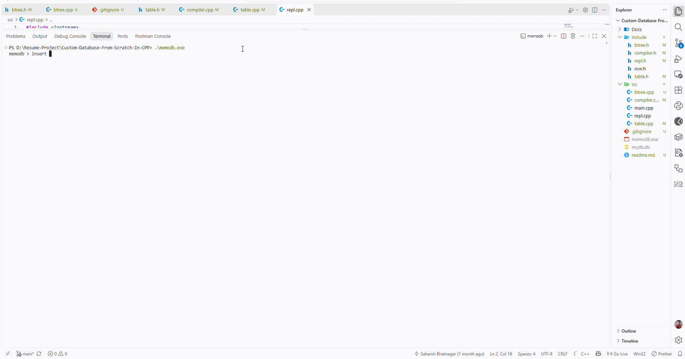

# Database From Scratch In Cpp

The core logic and storage management layer for a custom relational database engine. Built entirely from scratch in C++, this system securely processes SQL-like statements, manages low-level file I/O operations, and handles complex B-Tree memory layouts to persistently store data without relying on standard C++ objects or external database libraries.



---

### Prerequisites
Make sure you have a C++ compiler (such as GCC/g++) installed on your machine.

## Getting Started

### Installation

1. Clone the repository:
    ```bash
    git clone https://github.com/saharshbhatnagar/Custom-Database-From-Scratch-In-CPP.git
    ```

2. Navigate to the project directory:

    ```bash
    cd Custom-Database-From-Scratch-In-CPP
    ```

3. Compile the database engine:

    ```bash
    g++ -Iinclude src/main.cpp src/repl.cpp src/compiler.cpp src/table.cpp src/btree.cpp -o memodb.exe
    ```

4. Start the database shell:

    If using Windows:
    ```bash
    .\memodb.exe
    ```
    If using Linux/macOS/WSL:
    ```bash
    ./memodb.exe
    ```

5. Database Usage & Syntax:

    Once the REPL (Read-Eval-Print Loop) is running, you can interact with the engine using the following custom commands:

    * **`insert <id> <username> <email>`**: Inserts a new row into the B-Tree.
    * **`select`**: Performs a full table scan, returning all saved rows.
    * **`select <id>`**: Utilizes binary search to instantly fetch a specific row.
    * **`update <id> <username> <email>`**: Modifies the data of an existing row.
    * **`delete <id>`**: Removes a row and shifts memory to shrink the node.
    * **`.exit`**: Safely flushes the memory cache to the physical disk and terminates the program.

### Directory Structure

```plaintext
Custom-Database-From-Scratch-In-CPP/
├── include/
│   ├── btree.h
│   ├── compiler.h
│   ├── repl.h
│   ├── row.h
│   └── table.h
├── src/
│   ├── btree.cpp
│   ├── compiler.cpp
│   ├── main.cpp
│   ├── repl.cpp
│   └── table.cpp
└── README.md
```

### Additional Documentation

**Architecture Details**

This database acts as a standalone, persistent storage engine. Instead of relying on standard C++ structs that are subject to compiler padding, the storage layer treats memory as raw 4KB blocks. It utilizes precise pointer arithmetic to format B-Tree nodes, ensuring strict alignment with the operating system's file blocks.

**Compiler & Virtual Machine:** Features a custom tokenizer and parser that translates human-readable SQL-like strings into bytecode instructions, which are then executed by a virtual machine routing to the correct memory operations.

**B-Tree Storage:** Keeps all records strictly sorted by ID. Utilizes a Binary Search algorithm for efficient data retrieval in $O(\log N)$ time, bypassing the need for full table scans.

**Pager & OS Interface:** Manages the active memory cache. It reads and writes raw binary data directly to the local hard drive, ensuring data persistence across application restarts.

**Tech Stack:** C++, File I/O, Low-Level Memory Management